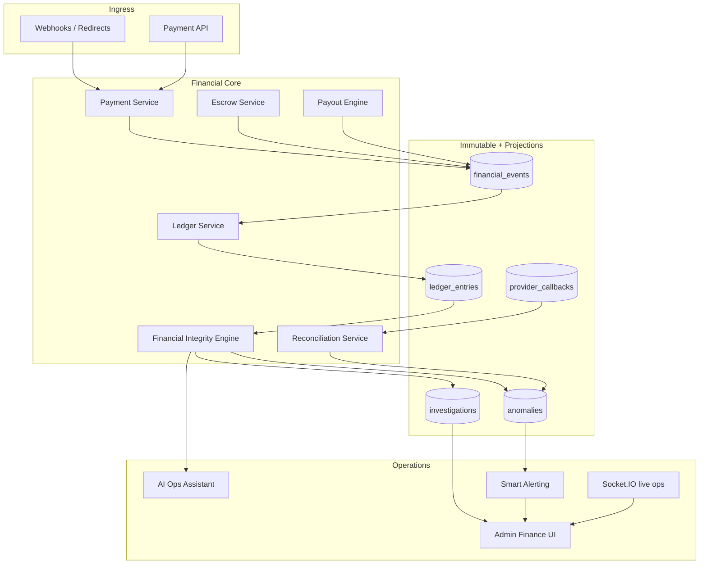
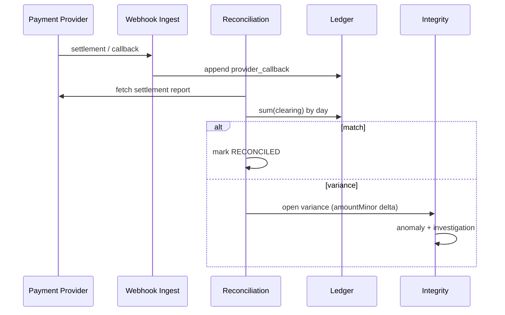

# SPACILLY Financial Integrity + Payment Intelligence

**Status:** Architecture v1 (grounded in current codebase)  
**North star:** No amount of money — even **1 FRW** — should disappear, mismatch, duplicate, or drift without immediate detection, explanation, isolation, and actionable diagnostics.

---

## 0. Current state (baseline)

SPACILLY today is a **pragmatic marketplace escrow** stack:

| Layer | What exists | Integrity gap |
|-------|-------------|-----------------|
| Inbound pay | `paymentService.finalizeSuccessfulEscrowPayment` (FW, MoMo, Stripe, PayPal, Airtel) | No idempotency keys on webhooks; amount not cross-checked to provider payload everywhere |
| State | `Order.payment`, `Order.escrow`, `Order.fees`, `Order.payout` mutated in place | Not event-sourced; hard to replay |
| Balances | `SellerWallet`, `EscrowWallet` counters | Direct mutation; can drift from sum of orders |
| Audit | `TransactionLog` (single-sided: PAYMENT, RELEASE, REFUND, FEE, WITHDRAWAL) | **Not double-entry**; `FEE` type rarely/never written |
| Outbound | `escrowService.releaseEscrow` → Flutterwave Transfer | Stripe/PayPal/MoMo refunds not unified |
| Withdraw | `POST /payments/seller/withdraw` | **Bookkeeping only** — no PSP transfer; `PayoutRequest` never created |
| Admin | `/admin/finance` (`PaymentsFinancial.tsx`) | No reconciliation variance, investigations, or ledger view |
| Fraud | `fraudSignalEngine` (reviews), `FraudAlert`, `escrowTrust` | Not gating `finalizeSuccessfulEscrowPayment` |

**Strategic decision:** Introduce a **Financial Integrity Engine (FIE)** as an append-only **ledger + event stream** *alongside* existing models, then migrate reads and eventually retire direct balance mutation.

---

## 1. Architecture overview



### Service boundaries

| Service | Responsibility | Owns |
|---------|----------------|------|
| **Payment Service** | Provider sessions, capture, idempotent finalize | Orchestration only — **never** mutates balances directly after migration |
| **Ledger Service** | Double-entry append, account balances as projections | `ledger_entries`, balance snapshots |
| **Escrow Service** | Hold / release / refund *commands* | Emits events; PSP calls |
| **Payout Engine** | Seller withdrawals, batch payouts | `PayoutRequest` + PSP |
| **Reconciliation Service** | Internal vs provider vs expected | `reconciliations`, variance records |
| **Financial Integrity Engine** | Invariants, drift detection, freeze, RCA | `anomalies`, severity, exposure |
| **Audit Service** | Tamper-evident chain, operator actions | `audit_events` |
| **Risk / Fraud Engine** | Velocity, trust, holds | `risk_events` |
| **Notification Service** | Smart grouped alerts (existing + finance channel) | Deep links to investigations |

---

## 2. Event-driven money model

Payments are **event streams**, not row updates.

### Canonical financial events

```
PAYMENT_CREATED
PAYMENT_AUTHORIZED
PAYMENT_CAPTURED          ← maps to finalizeSuccessfulEscrowPayment
FEE_ASSESSED
ESCROW_HOLD_RECORDED
ESCROW_RELEASE_REQUESTED
ESCROW_RELEASED
PAYOUT_SCHEDULED
PAYOUT_INITIATED
PAYOUT_COMPLETED
PAYOUT_FAILED
REFUND_INITIATED
REFUND_COMPLETED
CHARGEBACK_RECEIVED
LEDGER_ADJUSTMENT         ← admin-only, dual approval
RECONCILIATION_VARIANCE
INTEGRITY_ANOMALY_DETECTED
```

### Event envelope (every event)

```typescript
interface FinancialEventEnvelope {
  eventId: string;              // UUID v7
  eventType: FinancialEventType;
  version: 1;
  occurredAt: string;           // ISO-8601 UTC
  recordedAt: string;
  correlationId: string;        // orderId or payoutBatchId
  traceId: string;              // OpenTelemetry trace
  causationId?: string;         // prior eventId
  idempotencyKey: string;       // unique per side-effect
  actor: { type: 'system' | 'buyer' | 'seller' | 'admin' | 'provider'; id?: string };
  sourceService: string;
  payload: Record<string, unknown>;
  payloadChecksum: string;      // sha256(canonical JSON)
  previousEventHash?: string;   // hash chain optional per aggregate
  signatureHash?: string;       // HMAC for tamper evidence
}
```

### Mapping from today’s `TransactionLog`

| Legacy `TransactionLog.type` | New events | Ledger posting |
|-----------------------------|------------|----------------|
| PAYMENT | PAYMENT_CAPTURED + FEE_ASSESSED + ESCROW_HOLD_RECORDED | See §4 |
| RELEASE | ESCROW_RELEASED + PAYOUT_* | Debit escrow liability, credit seller payable |
| REFUND | REFUND_* | Reverse hold / payable |
| FEE | FEE_ASSESSED | Credit platform revenue |
| WITHDRAWAL | PAYOUT_* | Debit seller payable, credit PSP clearing |

---

## 3. Double-entry chart of accounts

All amounts in **integer minor units** (`amountMinor: bigint` stored as string in Mongo).

### Account taxonomy

```
ASSET
  asset.psp.flutterwave.clearing
  asset.psp.stripe.clearing
  asset.psp.paypal.clearing
  asset.psp.momo.clearing

LIABILITY
  liability.escrow.order.{orderId}      // optional sub-ledger per order
  liability.escrow.pool
  liability.seller.payable.{sellerId}
  liability.buyer.refund_due.{buyerId}

REVENUE
  revenue.platform.commission
  revenue.platform.insurance

EXPENSE
  expense.psp.processing_fee
```

### Example: buyer pays 10,000 RWF (platform fee 5%, PSP fee 1.4%)

| Step | Debit | Credit | Amount (minor) |
|------|-------|--------|----------------|
| Capture | `asset.psp.*.clearing` | `liability.escrow.pool` | 1,000,000 |
| Platform fee | `liability.escrow.pool` | `revenue.platform.commission` | 50,000 |
| PSP fee | `liability.escrow.pool` | `expense.psp.processing_fee` | 14,000 |
| Seller share | `liability.escrow.pool` | `liability.seller.payable.{sellerId}` | 936,000 |

**Rule:** `sum(debits) === sum(credits)` per `postingId`. No direct `SellerWallet.balance.pending += x`.

### Balance projection

```text
balance(accountId) = Σ credits − Σ debits   (per currency)
```

Recompute on demand; cache in Redis with version keyed by `lastLedgerEntryId`.

---

## 4. Ledger design

### `ledger_entries` document

```typescript
interface LedgerEntry {
  entryId: string;
  postingId: string;           // groups balanced lines
  transactionId: string;       // business txn (orderId, payoutId)
  correlationId: string;
  eventId: string;
  account: string;
  side: 'debit' | 'credit';
  amountMinor: string;         // integer string
  currency: string;            // ISO 4217
  exchangeRate?: string;       // fixed-point string if FX
  sourceService: string;
  actor: { type: string; id?: string };
  reason: string;
  createdAt: Date;
  checksum: string;            // hash(line fields)
  prevEntryHash?: string;
  signatureHash?: string;
}
```

**Indexes:** `{ postingId: 1 }`, `{ transactionId: 1, createdAt: 1 }`, `{ account: 1, currency: 1, createdAt: -1 }`, `{ eventId: 1 }` unique.

### Posting API (internal)

```http
POST /internal/ledger/postings
Idempotency-Key: {idempotencyKey}

{
  "correlationId": "order_abc",
  "eventId": "evt_...",
  "currency": "RWF",
  "lines": [
    { "account": "asset.psp.stripe.clearing", "side": "debit", "amountMinor": "1000000" },
    { "account": "liability.escrow.pool", "side": "credit", "amountMinor": "1000000" }
  ],
  "reason": "PAYMENT_CAPTURED"
}
```

Returns `409` if idempotency key seen with different body.

---

## 5. Financial Integrity Engine (FIE)

Continuous + on-demand verification.

### Invariants (hard failures → anomaly)

| ID | Rule |
|----|------|
| INV-01 | Every `postingId` balances (debits = credits) |
| INV-02 | Escrow pool liability ≥ sum(open orders ESCROW_HOLD) |
| INV-03 | Seller payable = ledger projection (≠ wallet doc after cutover) |
| INV-04 | No duplicate `idempotencyKey` with conflicting amounts |
| INV-05 | `PAYMENT_CAPTURED` amount === provider webhook amount |
| INV-06 | No `PAYOUT_COMPLETED` without prior `PAYOUT_INITIATED` |
| INV-07 | No negative balances on asset/revenue accounts |
| INV-08 | Refund total ≤ captured total per order |
| INV-09 | `EscrowWallet` aggregates match ledger (migration window) |
| INV-10 | Orphan webhook → quarantine queue, no silent finalize |

### On 1 FRW mismatch

1. **Freeze** — block new releases/payouts touching affected accounts (`freezeToken` on seller/order)
2. **Isolate** — tag `correlationId`, `traceId`, provider ref
3. **Timeline** — assemble events + callbacks + retries
4. **Exposure** — `affectedUsers`, `estimatedExposureMinor`
5. **Severity** — `low | medium | high | critical` (see §12)
6. **RCA hypothesis** — template + LLM optional (§11)
7. **Surface** — investigation UI + single grouped alert

### Scheduled jobs (BullMQ)

| Job | Cadence | Action |
|-----|---------|--------|
| `integrity.fullScan` | 5 min | All invariants |
| `integrity.escrowVsOrders` | 1 min | Open escrow |
| `integrity.walletProjection` | 15 min | Wallet vs ledger |
| `reconciliation.psp.daily` | Daily | Provider settlement files |
| `reconciliation.payoutBatches` | Hourly | Transfer status |

---

## 6. Reconciliation engine



### `reconciliations` record

```typescript
interface ReconciliationRun {
  runId: string;
  provider: 'flutterwave' | 'stripe' | 'paypal' | 'momo' | 'airtel';
  periodStart: string;
  periodEnd: string;
  expectedMinor: string;
  actualMinor: string;
  varianceMinor: string;
  status: 'matched' | 'variance' | 'pending';
  unmatchedRefs: string[];
  createdAt: Date;
}
```

**Fractional drift:** compare in minor units; flag if `|variance| >= 1` (1 FRW).

---

## 7. Root cause analysis (RCA) engine

Rule-based templates first; LLM summarizes evidence.

| Pattern | Hypothesis |
|---------|------------|
| Duplicate `PAYOUT_COMPLETED` same `providerRef` | Async retry after provider timeout |
| Capture amount > webhook amount | Race: partial capture + full finalize |
| Escrow ↓ without RELEASE event | Direct wallet mutation (legacy path) |
| Refund after release | Refund reversal sequence incomplete |
| Spike in `PAYMENT_CAPTURED` velocity | Retry storm or promotion abuse |

Output stored on `investigations.rcaHypothesis` with `confidence` and `evidenceEventIds[]`.

---

## 8. Provider resilience

### Idempotency

- **Keys:** `{provider}:{providerRef}:{eventType}` and client `Idempotency-Key` header
- **Store:** Redis + unique Mongo index on `financial_events.idempotencyKey`
- **Webhook:** verify signature → persist raw `provider_callbacks` → enqueue worker → idempotent handler

### Failure modes

| Failure | Handling |
|---------|----------|
| Timeout | Mark `PENDING_PROVIDER`; retry with exponential backoff; max 8 |
| Duplicate callback | 200 OK, no-op if idempotency hit |
| Delayed callback | Reconciliation job links to order |
| Partial success | Compensating `REFUND` or `LEDGER_ADJUSTMENT` + investigation |
| Retry storm | Circuit breaker per provider; DLQ after N |

### Distributed lock

`redlock` on `correlationId` for: finalize, release, refund, withdraw.

---

## 9. Integration plan (SPACILLY-specific)

### Phase 0 — Foundation (week 1–2)

- [ ] `server/src/financial/money.ts` — minor units only
- [ ] Models: `FinancialEvent`, `LedgerEntry`, `FinancialAnomaly`, `FinancialInvestigation`, `ProviderCallback`
- [ ] `financialLedger.service.ts` — balanced postings
- [ ] `financialIntegrity.service.ts` — INV-01, INV-04, INV-05 hooks
- [ ] Wire **read-only** projection after `finalizeSuccessfulEscrowPayment` (shadow mode)

### Phase 1 — Capture path (week 3–4)

Hook **`paymentService.finalizeSuccessfulEscrowPayment`**:

```typescript
await financialLedger.postPaymentCaptured({
  orderId, provider, providerRef,
  grossMinor, platformFeeMinor, pspFeeMinor, sellerNetMinor,
  currency, idempotencyKey, traceId,
});
await financialIntegrity.verifyPaymentCapture(ctx);
```

Emit `FEE` equivalent ledger lines (fixes admin FEE metrics).

### Phase 2 — Release / refund (week 5–6)

Hook **`escrowService.releaseEscrow`** / **`refundBuyer`**:

- Branch refunds by `order.payment.provider`
- Flutterwave transfer remains; add Stripe/PayPal refund APIs
- Ledger: escrow → seller payable → PSP clearing

### Phase 3 — Payout integrity (week 7–8)

- Unify `seller/withdraw` with `PayoutRequest` + PSP
- Block withdraw until ledger confirms available balance
- Admin approve → `PAYOUT_INITIATED` → webhook → `PAYOUT_COMPLETED`

### Phase 4 — Reconciliation (week 9–10)

- Daily settlement ingest per provider
- Admin **Reconciliation** tab in `PaymentsFinancial.tsx`

### Phase 5 — Ops UX (week 11–12)

- Investigation timeline UI
- Global finance search
- AI ops assistant (incident summary)

---

## 10. API contracts (admin / internal)

Base: `/api/admin/finance/integrity`

| Method | Path | Description |
|--------|------|-------------|
| GET | `/health` | Financial health score, open anomalies count |
| GET | `/anomalies` | Paginated, filter severity/status |
| GET | `/anomalies/:id` | Detail + timeline + ledger slice |
| POST | `/anomalies/:id/acknowledge` | Operator ack |
| POST | `/anomalies/:id/freeze` | Freeze accounts |
| POST | `/anomalies/:id/resolve` | Resolution notes |
| GET | `/investigations/:id` | Full investigation |
| POST | `/investigations` | Manual open |
| GET | `/reconciliation` | Runs + variances |
| POST | `/reconciliation/run` | Trigger provider recon |
| GET | `/ledger` | Query entries (account, orderId, date) |
| GET | `/search` | Global q= transaction, order, phone, ref |
| POST | `/replay` | Replay event → projection (superadmin) |

### WebSocket channels

- `finance:health` — health score updates
- `finance:anomaly` — new/changed anomalies
- `finance:investigation:{id}` — live timeline

---

## 11. AI operational assistant

**Inputs:** anomaly, last 50 events, provider callbacks, order snapshot, seller trust.

**Outputs:**

- Plain-language summary (max 120 words)
- Hypothesis + confidence
- Recommended actions (ordered)
- Similar past incidents

**Guardrails:** never auto-move money; suggest only; all actions audited.

**Example prompt context:**

> Refund volume +42% vs 7d baseline; 6 refunds share provider timeout window 2026-05-19T14:00Z.

---

## 12. Smart alerting

### Priority matrix

| Condition | Priority |
|-----------|----------|
| \|variance\| ≥ 100,000 minor (100k RWF) | critical |
| \|variance\| ≥ 1 minor | high |
| Duplicate payout detected | critical |
| Reconciliation pending > 24h | medium |
| Provider degraded | medium |
| Velocity 3σ above baseline | high |

### Grouping

- Key: `{anomalyType}:{correlationId}` — suppress duplicates 30 min
- Digest: "3 payout inconsistencies may require review" (good)
- Never: raw error spam

Integrate with existing `sellerNotificationAssistant` / admin inbox for finance role.

---

## 13. Investigation UX (admin)

**Route:** `/admin/finance/investigations/:id`

### Layout (Linear × Stripe)

```
┌─────────────────────────────────────────────────────────┐
│  ● High · Escrow drift 1 RWF          [Freeze] [Resolve]│
│  Order #RW-20481 · Flutterwave · opened 2m ago          │
├─────────────────────────────────────────────────────────┤
│  AI Summary                                             │
│  "Likely duplicate transfer callback after timeout..."    │
├──────────────┬──────────────────────────────────────────┤
│  Timeline    │  Ledger · Debits/Credits · Provider log   │
│  (vertical)  │  Affected users · Exposure: 1 RWF         │
│              │  Recommended actions                      │
└──────────────┴──────────────────────────────────────────┘
```

**Global search** (⌘K): orders, txn IDs, phone, payout batch, investigation ID.

---

## 14. Fraud & risk

| Signal | Source | Action |
|--------|--------|--------|
| Velocity | orders/hour per buyer | hold capture |
| Geo mismatch | IP vs shipping | flag |
| Duplicate accounts | device fingerprint | block payout |
| Refund abuse | refund rate | extend escrow |
| Trust score | `escrowTrust.service` | auto-review queue |

Wire `FinanceSettings.enableFraudChecks` at `initializePayment` + `finalizeSuccessfulEscrowPayment`.

Risk score 0–100 on `risk_events`; decay over 30d.

---

## 15. Observability

| Signal | Tool |
|--------|------|
| Traces | OpenTelemetry: `correlationId` baggage |
| Metrics | `finance.postings.total`, `finance.anomalies.open`, `finance.recon.variance_minor` |
| Logs | Structured JSON; never log PAN/secrets |
| Audit | `audit_events` immutable |

**Dashboards:** Financial Health, Reconciliation Status, Provider SLA, Queue depth, Integrity heatmap (accounts × variance).

---

## 16. Security

- Money math **server-only**; integer minor units
- Webhook HMAC verification (existing + enforce on all routes)
- RBAC: `finance:read`, `finance:investigate`, `finance:freeze`, `finance:adjust` (dual control)
- `LEDGER_ADJUSTMENT` requires two admin approvals
- Encrypt provider credentials (existing `paymentSecretsCrypto`)
- Session + IP anomaly on finance routes

---

## 17. MongoDB collections (new + existing)

| Collection | Purpose |
|------------|---------|
| `financial_events` | Event store |
| `ledger_entries` | Double-entry lines |
| `ledger_postings` | Posting metadata + idempotency |
| `reconciliations` | Recon runs |
| `provider_callbacks` | Raw webhook payload |
| `financial_anomalies` | Detected issues |
| `financial_investigations` | Ops cases |
| `balance_snapshots` | Point-in-time audit |
| `risk_events` | Fraud signals |
| `audit_events` | Operator + system audit |
| *(existing)* `transactionlogs` | Legacy; dual-write then deprecate |
| *(existing)* `orders`, `sellerwallets`, `escrowwallets` | Projections during migration |

---

## 18. Performance & consistency

- **Throughput:** ledger append O(1); batch postings in single Mongo transaction
- **Consistency:** strong per `correlationId` via lock; eventual cross-account via recon
- **Replay:** rebuild projections from `financial_events` + `ledger_entries`
- **Outage:** queue captures; no finalize without durable event write

---

## 19. Engineering standards

- TypeScript `strict`
- `decimal.js` or `bigint` only — **no `number` for money**
- Unit tests: posting balance, idempotency, refund caps
- Integration tests: webhook duplicate, timeout retry
- Property test: random posting sequence → balances reconcile

---

## 20. UI roadmap (`PaymentsFinancial.tsx`)

| Tab | Addition |
|-----|----------|
| Dashboard | Financial Health ring, open anomalies, recon status |
| **Integrity** (new) | Anomaly inbox, severity filters |
| **Investigations** (new) | Timeline + AI summary |
| **Ledger** (new) | Account explorer |
| Transactions | Link to ledger postings |
| Payouts | Real PSP status, freeze banner |
| Gateways | Provider health + last recon |

Design tokens: soft contrast, 8px grid, status colors only for severity, no spreadsheet grid overload.

---

## 21. Success metrics

| Metric | Target |
|--------|--------|
| Undetected variance duration | < 5 minutes |
| Mean time to isolate | < 2 minutes |
| False positive alert rate | < 5% |
| Ledger replay correctness | 100% |
| Webhook idempotency | 100% |

---

## 22. Next implementation files

```
server/src/financial/money.ts
server/src/financial/accounts.ts
server/src/models/FinancialEvent.ts
server/src/models/LedgerEntry.ts
server/src/models/FinancialAnomaly.ts
server/src/models/FinancialInvestigation.ts
server/src/models/ProviderCallback.ts
server/src/services/financialLedger.service.ts
server/src/services/financialIntegrity.service.ts
server/src/services/financialReconciliation.service.ts
server/src/jobs/financialIntegrityJobs.ts
server/src/routes/adminFinancialIntegrityRoutes.ts
client/src/pages/admin/finance/FinancialIntegrity.tsx
client/src/pages/admin/finance/InvestigationDetail.tsx
```

**Single hook to enable shadow mode:** `paymentService.finalizeSuccessfulEscrowPayment` → `financialLedger.postPaymentCaptured`.

---

*This document is the source of truth for SPACILLY payment intelligence. Update version when phases ship.*
